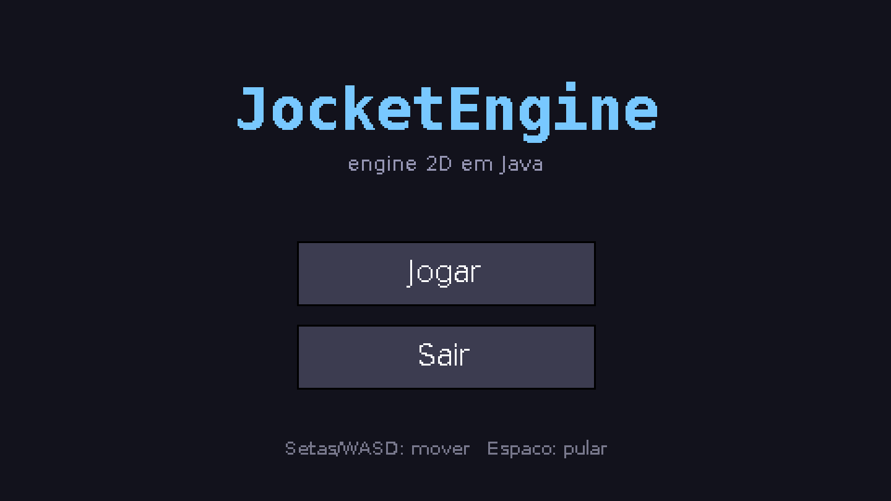
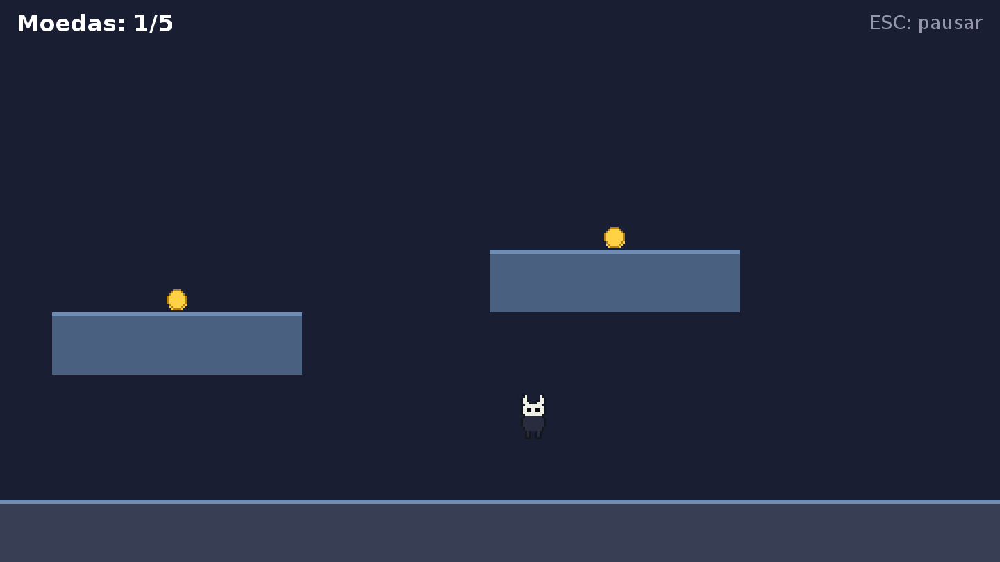

<h1 align="center">🚀 JocketEngine</h1>

<p align="center">
  <a href="https://github.com/eddchdev/JocketEngine/actions/workflows/maven.yml">
    
  </a>
  <a href="https://opensource.org/licenses/MIT">
    
  </a>
  <a href="https://www.oracle.com/java/technologies/javase/jdk17-archive-downloads.html">
    
  </a>
  
  
</p>

<p align="center">
  <b>Motor de jogos 2D em Java puro — modular, completo e sem dependências.</b><br>
  <i>Clonou, rodou. Só precisa do JDK: nada de bibliotecas nativas, drivers ou setup.</i>
</p>

<p align="center">
  
  
</p>

---

## Por que JocketEngine?

A maioria das engines 2D em Java exigem bibliotecas nativas (LWJGL/OpenGL),
builds por plataforma e bastante setup. A JocketEngine entrega um conjunto
**completo e modular** de sistemas de jogo usando **apenas o JDK** — então a
barreira para alguém clonar, rodar e contribuir é praticamente zero.

### ✨ Diferenciais

- 🧩 **Zero dependências de runtime.** Roda em qualquer SO só com Java. JAR final < 60 KB.
- 🔊 **SFX procedural.** Sons sintetizados em código (`Sfx.coin()`), sem arquivos de áudio.
- 🛡️ **Personagem procedural animado.** O herói é pixel art definido em código, com ciclo de caminhada — sem assets.
- 🔡 **Tipografia nítida.** O mundo é pixel art (nearest-neighbor); a UI é renderizada em resolução nativa com antialiasing.
- 🎚️ **Pronta para produção.** 88 testes automatizados, CI no GitHub Actions e JAR executável.

---

## 🧱 Módulos

A engine é organizada em módulos independentes — use só o que precisar.

| Módulo        | Responsabilidade                                                      |
|---------------|----------------------------------------------------------------------|
| `core`        | `Engine` (janela + loop de tempo fixo + escala pixel art), `GameConfig` |
| `scene`       | Pilha de cenas com sobreposições (pausa por cima do jogo)            |
| `entities`    | Entidades + **componentes** reutilizáveis (física, animação, bob)    |
| `graphics`    | `Sprite` (pixel art via código), `SpriteAnimation`, **`Camera2D`**   |
| `tilemap`     | `TileMap` baseado em grade, com colisão integrada                    |
| `collision`   | Detecção de colisão AABB com eventos                                 |
| `events`      | Eventos com prioridade e cancelamento                                |
| `input`       | Teclado/mouse globais + **`InputMap`** (ações remapeáveis)           |
| `ui`          | Botões, rótulos, painéis, sliders, campos de texto + estilo          |
| `particles`   | Sistema de partículas (explosões, efeitos)                           |
| `tween`       | `Tween` + `Easing` (linear, quad, sine, back, bounce)               |
| `audio`       | `Audio` (volume/loop) + `Sfx` procedural                            |
| `assets`      | `Assets` unificado (texturas, sons, fontes) com cache                |
| `math`        | `MathUtils`, `Vector2`                                               |
| `utils`       | `Rectangle`, `Timer`, `Logger`, `Preferences` (save/load)           |

---

## 🚀 Começando

```bash
git clone https://github.com/eddchdev/JocketEngine.git
cd JocketEngine

mvn -q compile exec:java        # roda o demo
# ou: mvn -q package && java -jar target/JocketEngine.jar
```

**Controles:** `←`/`→` ou `A`/`D` mover · `↑`/`W`/`Espaço` pular · `ESC` pausar · mouse nos menus. Junte as 5 moedas.

---

## 🧠 Em código

**Iniciar a engine:**

```java
Engine.start(
    new GameConfig().title("Meu Jogo").logicalSize(480, 270).scale(3).targetFps(60),
    new MainMenuScene());
```

**Câmera que segue o jogador:**

```java
Camera2D camera = new Camera2D(Engine.getWidth(), Engine.getHeight());
camera.setBounds(0, 0, world.getWorldWidth(), world.getWorldHeight());
// no render:
camera.begin(g2);  /* desenha o mundo */  camera.end(g2);
// no update:
camera.follow(player.getX(), player.getY(), 0.12f);
```

**Tilemap com colisão:**

```java
TileMap map = new TileMap(grid, 30, 30).setSolid(1, 2);
player.setPlatforms(map.getAllSolidBounds());
```

**Input por ações (remapeável):**

```java
InputMap controls = new InputMap().bind("jump", KeyEvent.VK_SPACE, KeyEvent.VK_W);
if (controls.isPressed("jump")) player.jump();
```

**Partículas + SFX procedural + tween:**

```java
particles.burst(x, y, 16, new Color(255, 210, 70));
Audio.play(Sfx.coin());
tweens.add(new Tween(0, 1, 0.6f, Easing.BACK_OUT, s -> bannerScale = s));
```

**Salvar progresso:**

```java
new Preferences(new File("save.properties")).putInt("highScore", 1200).save();
```

---

## 🧪 Testes & qualidade

```bash
mvn test
```

**88 testes** JUnit 5 cobrem a lógica central — math, colisão, câmera, tilemap,
eventos, tween, partículas, preferências e mais — rodando em ambiente headless
no [GitHub Actions](.github/workflows/maven.yml) a cada push.

---

## 🛣️ Roadmap

- [ ] Backend de renderização acelerado por hardware (opcional)
- [ ] Editor visual de tilemaps e fases
- [ ] Suporte a gamepad
- [ ] Sistema de luz/sombra 2D
- [ ] Multiplayer básico

---

## 🤝 Contribuindo

Veja o [CONTRIBUTING.md](CONTRIBUTING.md). Princípio do projeto: **sem
dependências de runtime** — só o JDK.

## 📜 Licença

[Licença MIT](LICENSE).
